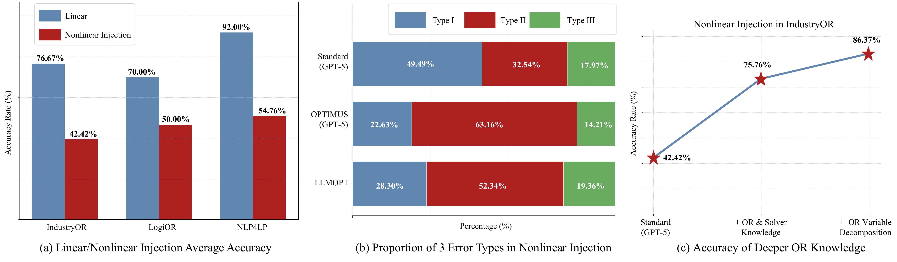
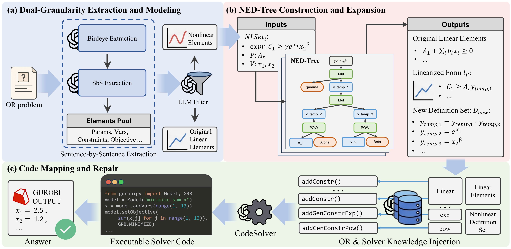
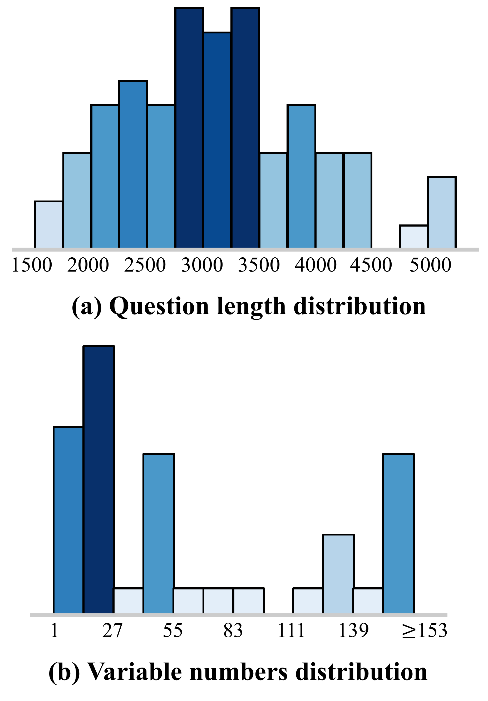
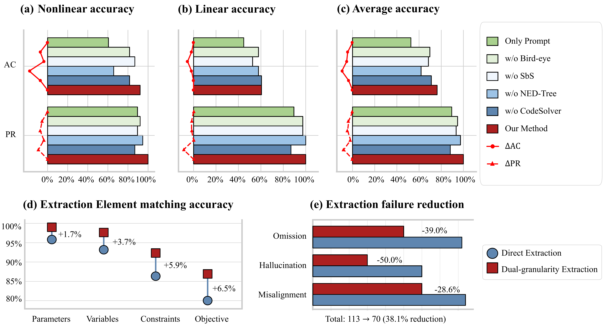

# NED-Tree and NEXTOR

This repository contains the 2026-06-22 code, data, and figure snapshot for **NED-Tree: Bridging the Semantic Gap with Nonlinear Element Decomposition Tree for LLM Nonlinear Optimization Modeling**. It updates the earlier `MirrorNew/NExT` release from a lightweight NExT/NORA repository into the current **NED-Tree + NEXTOR** research artifact.

NED-Tree targets the nonlinear semantic gap in natural-language-to-solver modeling. The framework combines dual-granularity element extraction, explicit nonlinear element filtering, recursive nonlinear decomposition, and solver-code mapping/repair. NEXTOR is the accompanying benchmark for long-context and nonlinear Operations Research (OR) modeling.

## Highlights

- **NED-Tree decomposition.** Complex nonlinear expressions are transformed into a linearized backbone plus an explicit new definition set of auxiliary variables and atomic nonlinear operators.
- **Dual-granularity extraction.** The agent pipeline extracts variables, parameters, constraints, objectives, and problem types with both bird-eye and sentence-by-sentence passes.
- **Solver-code mapping and repair.** Decomposed mathematical semantics are mapped to Gurobi-compatible code, then repaired through a code solver loop.
- **NEXTOR benchmark.** The benchmark covers linear, quadratic/conic, high-order power, fractional, exponential/logarithmic, long-text, table, multimodal, and redundant-content settings.

## Main Results In The 2026-06-22 Draft

| Setting | Metric |
|---|---:|
| Average over 10 OR benchmarks | 72.51% AC |
| Improvement over best non-fine-tuned baseline | +6.27% |
| Improvement over best comparable fine-tuned baseline | +13.02% |
| NEXTOR nonlinear split | 92.11% AC / 100.00% PR |
| NEXTOR linear split | 60.53% AC / 100.00% PR |

AC measures final-answer correctness. PR measures whether the generated solver program executes successfully.

## Figures

The PNG previews below are rendered from the authoritative PDF figures in `pic/`.

### Motivation: Nonlinear Semantic Gap


### Existing Nonlinear Modeling Errors



### Framework



### NEXTOR Synthesis Method


### NEXTOR Statistics



### Ablation Study



### Case Study


## Repository Layout

```text
.
|-- NEDTree-4R.py                    # Paper-aligned NED-Tree implementation
|-- NEDTree-4.py                     # Earlier engineering-oriented parser/builder
|-- RebuildNORA_easyread.py          # Main async multi-agent pipeline
|-- RebuildNORA_utils.py             # Execution, answer extraction, and evaluation helpers
|-- agents/                          # Modeling, extraction, coding, repair agents
|-- data/                            # Original and processed benchmark data
|-- NORA_process_data/               # Processed inputs for end-to-end runs
|-- runs/                            # Single-run experiment outputs
|-- runs_ALL/                        # Full-process experiment outputs
|-- pic/                             # 2026-06-22 figure PDFs and PNG previews
|-- tests/                           # Lightweight regression checks
|-- fig*.py                          # Plotting and figure-generation scripts
|-- get_sample_dataset.py            # Dataset construction and sampling utilities
|-- calculate_LABC_category_accuracy.py
`-- 文件整理与论文索引.md             # Local evidence map between code, data, and paper
```

## Installation

Use Python 3.12. The project was developed with Gurobi 12.0.2 for solver execution.

```powershell
python -m venv .venv
.\.venv\Scripts\Activate.ps1
python -m pip install -r requirements.txt
```

For Chinese paths and tree-printing output on Windows, set UTF-8 output:

```powershell
$env:PYTHONIOENCODING = 'utf-8'
```

Gurobi execution requires a valid local Gurobi installation and license. The NED-Tree decomposition demo and tests only require `sympy`.

## Quick Start

Run the NED-Tree case-study decomposition:

```powershell
$env:PYTHONIOENCODING = 'utf-8'
python .\NEDTree-4R.py
```

Minimal Python usage:

```python
from importlib.util import module_from_spec, spec_from_file_location

spec = spec_from_file_location("nedtree4r", "NEDTree-4R.py")
module = module_from_spec(spec)
spec.loader.exec_module(module)

ned = module.TopDownNEDTree(
    params=["alpha", "beta", "gamma"],
    vars_list=["x_1", "x_2", "x_3"],
)
result = ned.process(
    r"alpha + beta * 3^x_1 * exp(2*x_2) + gamma * cos(log(x_3)) \ge 10"
)
print(result["linear_expr"])
print(result["definitions"])
```

Run lightweight regression checks:

```powershell
python .\tests\test_nedtree.py
```

## End-to-End Agent Pipeline

`RebuildNORA_easyread.py` is the main async entry for the multi-agent workflow. It loads processed benchmark entries, performs extraction/modeling/code generation, runs generated code, repairs failures, and writes per-case artifacts to `runs/` or `runs_ALL/`.

The script expects API credentials through environment variables:

```powershell
$env:OPENAI_API_KEY = '<your-api-key>'
$env:OPENAI_API_BASE = '<optional-compatible-base-url>'
```

Inspect the available CLI options with:

```powershell
python .\RebuildNORA_easyread.py --help
```

## Data

The repository keeps the experiment evidence used by the manuscript:

- `data/20251021_origin_datasets/`: source benchmark JSON files.
- `data/20251129_ORThought_datasets/`: ORThought-style processed instances.
- `data/20251231_processedDATA/`: processed ORSample data.
- `NORA_process_data/`: processed NORA/NEXTOR inputs for pipeline runs.
- `runs/` and `runs_ALL/`: execution traces, generated code, and aggregate `AAA_result_*` files.

Large generated artifacts are intentionally separated from the algorithm entry points so the core NED-Tree logic can be tested without running full LLM or Gurobi experiments.

## Citation

If you use this artifact, cite the associated NED-Tree / NEXTOR manuscript. A BibTeX entry will be added after the paper metadata is finalized.

## License

This project follows the MIT License used by the original `MirrorNew/NExT` repository.
