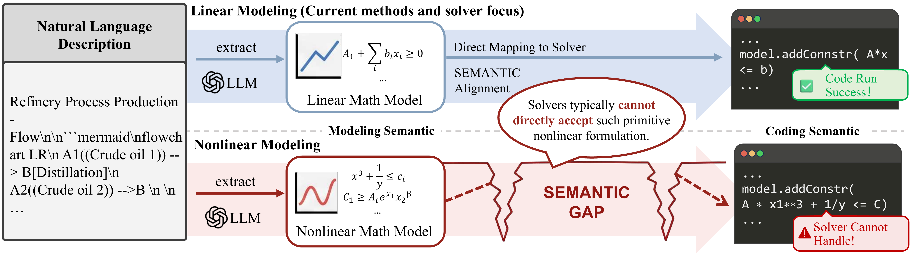
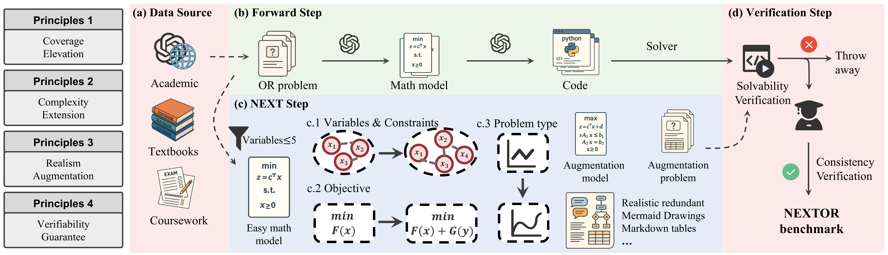
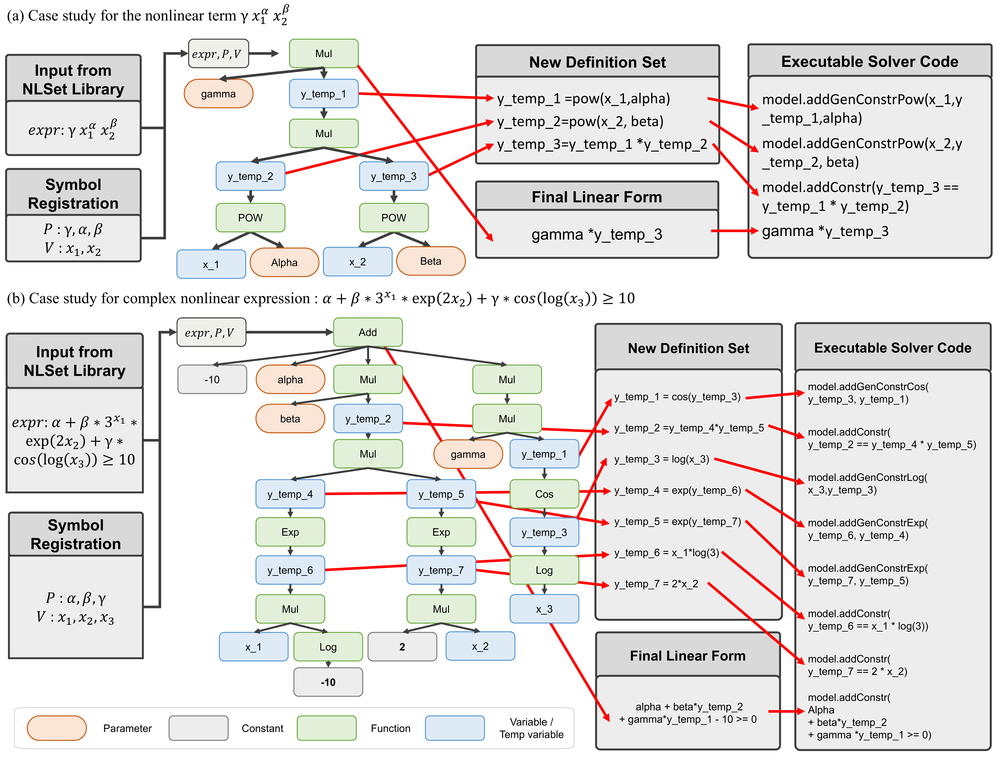

# NED-Tree and NEXTOR

This repository contains the public code and data artifact for **NED-Tree + NEXTOR**. It replaces the earlier lightweight NExT/NORA release with the current end-to-end nonlinear OR modeling pipeline, the paper-aligned NED-Tree implementation, the NEXTOR benchmark files, offline validation gates, and the final controlled representation diagnostic.

NED-Tree targets the nonlinear semantic gap in natural-language-to-solver modeling. The framework combines dual-granularity element extraction, explicit nonlinear element filtering, recursive nonlinear decomposition, and solver-code mapping/repair. NEXTOR is the accompanying benchmark for long-context and nonlinear Operations Research (OR) modeling.

## Highlights

- **NED-Tree decomposition.** Complex nonlinear expressions are transformed into a linearized backbone plus an explicit new definition set of auxiliary variables and atomic nonlinear operators.
- **Dual-granularity extraction.** The agent pipeline extracts variables, parameters, constraints, objectives, and problem types with both bird-eye and sentence-by-sentence passes.
- **Solver-code mapping and repair.** Decomposed mathematical semantics are mapped to Gurobi-compatible code, then repaired through a code solver loop.
- **NEXTOR benchmark.** The benchmark covers linear, quadratic/conic, high-order power, fractional, exponential/logarithmic, long-text, table, multimodal, and redundant-content settings.

## Reported Manuscript Results

| Setting | Metric |
|---|---:|
| Average over 10 OR benchmarks | 72.51% AC |
| Improvement over best non-fine-tuned baseline | +6.27% |
| Improvement over best comparable fine-tuned baseline | +13.02% |
| NEXTOR nonlinear split | 92.11% AC / 100.00% PR |
| NEXTOR linear split | 60.53% AC / 100.00% PR |

AC measures final-answer correctness. PR measures whether the generated solver program executes successfully.

## Figures

The PNG previews below are released in `pic/`.

### Motivation: Nonlinear Semantic Gap



### Existing Nonlinear Modeling Errors


### Framework


### NEXTOR Synthesis Method



### NEXTOR Statistics


### Ablation Study


### Case Study



## Repository Layout

```text
.
|-- NEDTree-4R.py                    # Paper-aligned NED-Tree implementation
|-- nedtree_4r_adapter.py            # Adapter from processed entries to NEDTree-4R
|-- RebuildNORA_easyread.py          # Main async multi-agent pipeline
|-- RebuildNORA_utils.py             # Execution, answer extraction, and evaluation helpers
|-- agents/                          # Modeling, extraction, coding, repair agents
|-- data/20251021_origin_datasets/   # NEXTOR source files
|-- NORA_process_data/               # Frozen gpt-5.1 structured inputs
|-- experiments/representation_paths/ # Final clean diagnostic inputs/results
|-- pic/                             # Figure previews used in this README
|-- tests/                           # Offline regression checks
`-- validate_nextor_harness.py       # Read-only NEXTOR/Harness validation
```

## Installation

Use Python 3.12. The project was developed with Gurobi 12.0.2 for solver execution.

```powershell
python -m venv .venv
.\.venv\Scripts\Activate.ps1
python -m pip install -r requirements.txt
```

For Chinese paths and tree-printing output on Windows, set UTF-8 output:

```powershell
$env:PYTHONIOENCODING = 'utf-8'
```

Gurobi execution requires a valid local Gurobi installation and license. The NED-Tree decomposition demo and tests only require `sympy`.

## Quick Start

Run the NED-Tree case-study decomposition:

```powershell
$env:PYTHONIOENCODING = 'utf-8'
python .\NEDTree-4R.py
```

Minimal Python usage:

```python
from importlib.util import module_from_spec, spec_from_file_location

spec = spec_from_file_location("nedtree4r", "NEDTree-4R.py")
module = module_from_spec(spec)
spec.loader.exec_module(module)

ned = module.TopDownNEDTree(
    params=["alpha", "beta", "gamma"],
    vars_list=["x_1", "x_2", "x_3"],
)
result = ned.process(
    r"alpha + beta * 3^x_1 * exp(2*x_2) + gamma * cos(log(x_3)) \ge 10"
)
print(result["linear_expr"])
print(result["definitions"])
```

Run the offline regression suite:

```powershell
python -m pytest -q .\tests
```

Validate the released nonlinear NEXTOR source/processed pair without an API call:

```powershell
python .\validate_nextor_harness.py `
  --subset-ids 13,14,16,20,24
```

## End-to-End Agent Pipeline

`RebuildNORA_easyread.py` is the main async entry for the multi-agent workflow. It loads processed benchmark entries, performs extraction/modeling/code generation, runs generated code, repairs failures, and writes per-case artifacts to the selected output directory. Historical run directories and discarded diagnostic attempts are intentionally not part of this release.

The script expects API credentials through environment variables:

```powershell
$env:OPENAI_API_KEY = '<your-api-key>'
$env:OPENAI_API_BASE = '<optional-compatible-base-url>'
```

Inspect the available CLI options with:

```powershell
python .\RebuildNORA_easyread.py --help
```

Run the released nonlinear structured input through the original agent configuration:

```powershell
python .\RebuildNORA_easyread.py `
  --agent `
  --model gpt-5.1 `
  --dataset_name NExTNLP `
  --mode run
```

The historical/default model choice remains `gpt-5.1`; pass
`--model gpt-5.1` explicitly for new runs. Every agent response must report
that exact model id or the run stops with `MODEL_ID_MISMATCH`. NEDTree-4R is
connected through the opt-in `--nedtree_4r` flag, so old outputs are not
silently relabeled as NED-Tree runs.

Generated solver programs run with an allowlisted subprocess environment that
does not inherit API, proxy, or cloud credentials. This is credential
isolation, not a complete operating-system sandbox; use a container or an
otherwise isolated account for untrusted generated code.

## Data

The release keeps the NEXTOR files needed by the public pipeline and validator:

- `data/20251021_origin_datasets/NExTLP.json`: NEXTOR linear split.
- `data/20251021_origin_datasets/NExTNLP.json`: NEXTOR nonlinear split.
- `data/classification_nextor.json`: NEXTOR category labels.
- `NORA_process_data/NExTLP_NORA_gpt-5.1.json` and `NExTNLP_NORA_gpt-5.1.json`: frozen structured inputs produced with the historical/default `gpt-5.1` configuration.

The processed files preserve the corresponding source questions and answers and are released for reproducibility; they are not silently substituted with the older o4-mini extraction. Large generated runs, intermediate prompts, credentials, and invalid or superseded diagnostic attempts are intentionally excluded.

## Controlled Representation Diagnostic

`experiments/representation_paths/` contains the ten frozen constraint inputs and the clean result summary for the final Native / Direct AST / NED-Tree diagnostic. Across 30 one-shot generated programs, Native and NED-Tree run in 10/10 cases; Direct AST runs in 9/10, with one observed Type II solver-interface error. This supports the narrow mechanism claim that NED-Tree avoided the observed Direct-AST mapping error while matching Native on these cases; it does not establish universal superiority over Native.

## Citation

If you use this artifact, cite the associated NED-Tree / NEXTOR manuscript. A BibTeX entry will be added after the paper metadata is finalized.

## License

The source code follows the MIT License used by the original `MirrorNew/NExT` repository. Dataset files are provided for research and reproducibility; the MIT license should not be read as relicensing third-party source material that may be represented in benchmark instances. Users remain responsible for respecting applicable upstream dataset terms.
